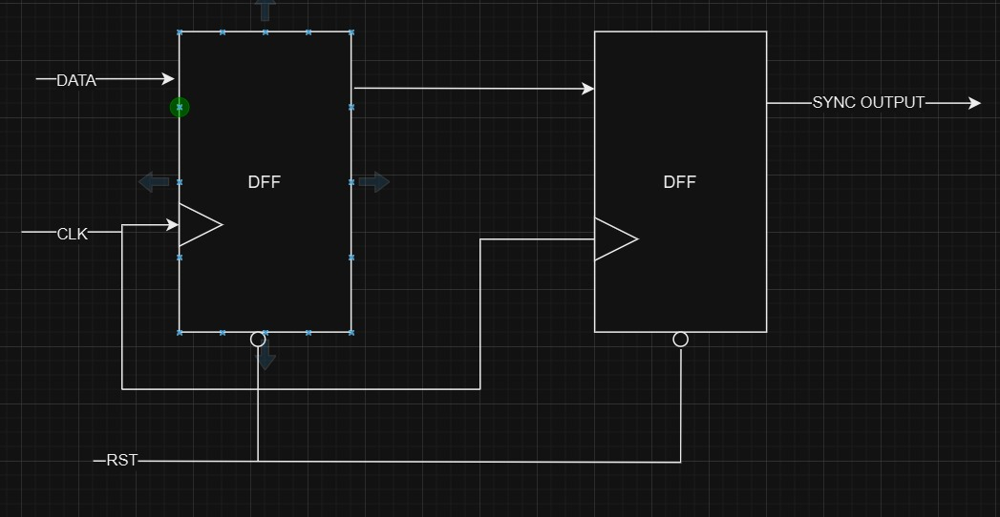
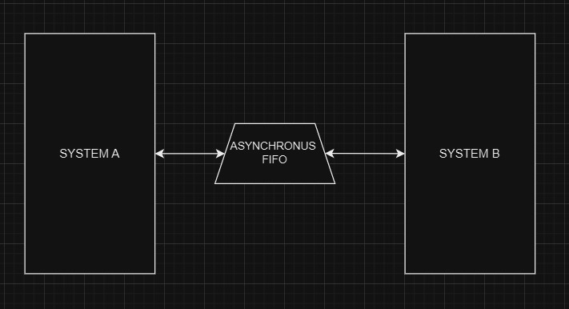
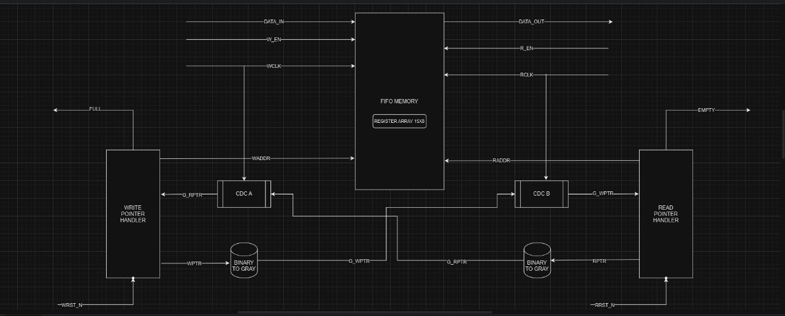
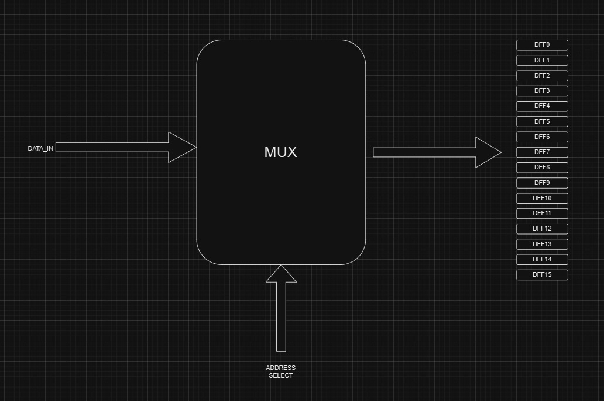

# Synthesizable RTL Design of Asynchronous FIFO with STA

## Introduction

An asynchronous FIFO is a type of FIFO design in which data values are written to a FIFO buffer from one clock domain and read from the same FIFO buffer in another clock domain, where the two clock domains are asynchronous to one another. Asynchronous FIFOs are essential for safely transferring data between different clock domains. 

While there are multiple approaches to designing asynchronous FIFOs, many of these methods are flawed. Most incorrectly implemented FIFO designs function correctly around 90% of the time. Designs that are nearly correct may operate reliably over 99% of the time. However, FIFOs that function correctly only 99% of the time may still have subtle design flaws, which are difficult to detect and debug (if noticed before product shipment) or costly to diagnose and recall if only discovered once in the hands of a customer.

This project provides a complete asynchronous FIFO design, implemented using synthesizable Verilog RTL code. Verification is performed with Yosys and the FreePDK standard cell library.

## Asynchronous FIFO Operation
In a synchronous FIFO, the write and read pointers are generated from the same clock. However, in an asynchronous FIFO, the write pointer is aligned with the write clock domain, while the read pointer is aligned with the read clock domain. As a result, domain crossing is required to determine FIFO full and empty conditions. This leads to metastability in the design. To address this metastability, two-flip-flop or three-flip-flop synchronisers can be used to pass the write and read pointers. For this explanation, we will use two-flip-flop synchronisers. Note that a single “2 FF synchroniser” can only resolve metastability for one bit. Therefore, depending on the write and read pointers, multiple 2 FF synchronisers are necessary.

## Usage of Binary to Gray Code Converter and Vice Versa in Asynchronous FIFO

In the previous sections, we discussed how to obtain asynchronous write and read pointers in their respective clock domains. However, binary-formatted write and read pointer values should not be directly transferred across clock domains due to the risk of metastability, which can result in inaccurate pointer values.

### The Problem

For example, when a binary value of `wr_ptr = 4’b1101` in the write clock domain is transferred through a 2FF synchroniser, the `wr_ptr` value might be received as `4’b1111` or another incorrect value in the read clock domain. This would cause an error in the FIFO operation. On the other hand, Gray code ensures that only a single bit changes between successive values, making it more stable for cross-domain data transfer.

### Solution: Gray Code Conversion

To prevent metastability and ensure proper data transfer, both the write and read pointers are converted into their corresponding Gray code in their respective clock domains before being passed to the opposite domain. 

### Why Gray to binary converter?

Gray to binary converter is beneficial because it reduces the number of transitions required when representing successive binary numbers. Each increment in Gray code results in only a single bit change, which:
- Reduces switching activity
- Decreases power consumption
- Minimises glitch formation

The lower switching activity also helps reduce the likelihood of metastability, which can occur when comparing two pointers (representing 5-bit read and write addresses). By lowering the number of transitions, the combinational logic (such as an XNOR gate used for equivalency checks) can more accurately interpret signals that transition between `1` and `0`, or `0` and `1`, ensuring correct data interpretation.

###  The RTL design is synthesised using Yosys which is having in build SAT solvers for logic optimization with the FreePDK library, thereby making the design synthesizable. A separate synthesizable memory array is designed using multiplexers and D flip-flops. After synthesis, static timing analysis is performed using OpenSTA.

# STATIC TIMING ANALYSIS

