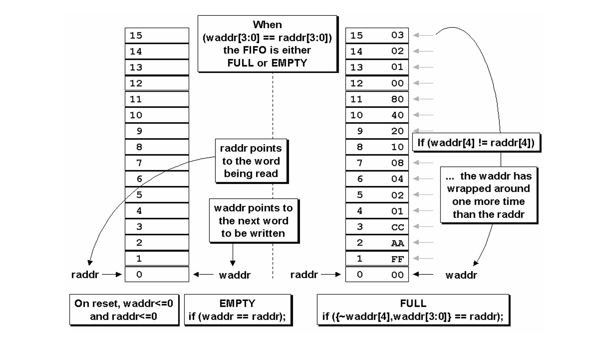
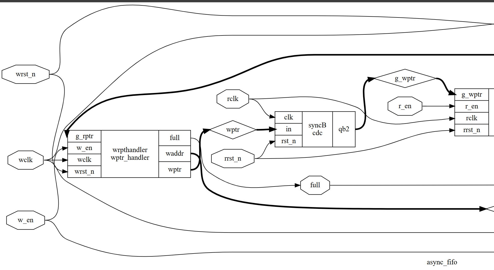
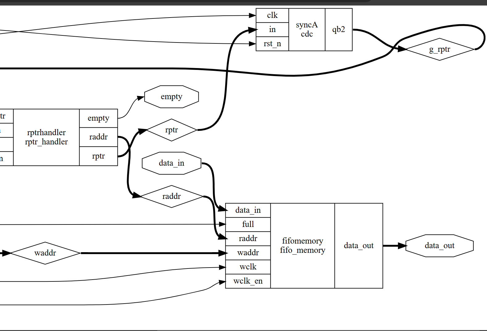

# Synthesizable RTL Design of Asynchronous FIFO with STA

## Introduction

An asynchronous FIFO is a type of FIFO design in which data values are written to a FIFO buffer from one clock domain and read from the same FIFO buffer in another clock domain, where the two clock domains are asynchronous to one another. Asynchronous FIFOs are essential for safely transferring data between different clock domains. 

While there are multiple approaches to designing asynchronous FIFOs, many of these methods are flawed. Most incorrectly implemented FIFO designs function correctly around 90% of the time. Designs that are nearly correct may operate reliably over 99% of the time. However, FIFOs that function correctly only 99% of the time may still have subtle design flaws, which are difficult to detect and debug (if noticed before product shipment) or costly to diagnose and recall if only discovered once in the hands of a customer.

This project provides a complete asynchronous FIFO design, implemented using synthesizable Verilog RTL code. Verification is performed with Yosys and the FreePDK standard cell library.

## Asynchronous FIFO Operation
In a synchronous FIFO, the write and read pointers are generated from the same clock. However, in an asynchronous FIFO, the write pointer is aligned with the write clock domain, while the read pointer is aligned with the read clock domain. As a result, domain crossing is required to determine FIFO full and empty conditions. This leads to metastability in the design. To address this metastability, two-flip-flop or three-flip-flop synchronisers can be used to pass the write and read pointers. For this explanation, we will use two-flip-flop synchronisers. Note that a single “2 FF synchroniser” can only resolve metastability for one bit. Therefore, depending on the write and read pointers, multiple 2 FF synchronisers are necessary.

## Usage of Binary to Gray Code Converter and Vice Versa in Asynchronous FIFO

In the previous sections, we discussed how to obtain asynchronous write and read pointers in their respective clock domains. However, binary-formatted write and read pointer values should not be directly transferred across clock domains due to the risk of metastability, which can result in inaccurate pointer values.

### The Problem

For example, when a binary value of `wr_ptr = 4’b1101` in the write clock domain is transferred through a 2FF synchroniser, the `wr_ptr` value might be received as `4’b1111` or another incorrect value in the read clock domain. This would cause an error in the FIFO operation. On the other hand, Gray code ensures that only a single bit changes between successive values, making it more stable for cross-domain data transfer.

### Solution: Gray Code Conversion

To prevent metastability and ensure proper data transfer, both the write and read pointers are converted into their corresponding Gray code in their respective clock domains before being passed to the opposite domain. 

### Why Gray to binary converter?

Gray to binary converter is beneficial because it reduces the number of transitions required when representing successive binary numbers. Each increment in Gray code results in only a single bit change, which:
- Reduces switching activity
- Decreases power consumption
- Minimises glitch formation

The lower switching activity also helps reduce the likelihood of metastability, which can occur when comparing two pointers (representing 5-bit read and write addresses). By lowering the number of transitions, the combinational logic (such as an XNOR gate used for equivalency checks) can more accurately interpret signals that transition between `1` and `0`, or `0` and `1`, ensuring correct data interpretation.

###  The RTL design is synthesised using Yosys which is having in build SAT solvers for logic optimization with the FreePDK library, thereby making the design synthesizable. A separate synthesizable memory array is designed using multiplexers and D flip-flops. After synthesis, static timing analysis is performed using OpenSTA.

# STATIC TIMING ANALYSIS

  
  

This analysis covers both maximum and minimum path delays for each path, helping to determine timing constraints and frequency limits for each clock domain in the asynchronous FIFO design.

## Key Observations and Analysis

### Path 1: Asynchronous Path (wrst_n to wrpthandler/41)
- **Clock**: CLK1
- **Type**: Asynchronous (recovery check against CLK1 rising edge)
- **Data Arrival Time**: 5.00 ns
- **Data Required Time**: 1000.05 ns
- **Slack**: 995.05 ns (MET)
- **Max Path Delay**: 5.00 ns

This path shows a large positive slack of 995.05 ns, meaning there is no timing violation. The Max Path Delay for this path is 5.00 ns.

### Path 2: Synchronous Path (w_en to wrpthandler/49)
- **Clock**: CLK1
- **Type**: Synchronous
- **Data Arrival Time**: 5.41 ns
- **Data Required Time**: 999.96 ns
- **Slack**: 994.55 ns (MET)
- **Max Path Delay**: 5.41 ns

The slack here is also positive, indicating no timing issues. The Max Path Delay for this path is 5.41 ns.

### Path 3: Cross-Domain Path (FIFO to data_out)
- **Clock**: CLK1 to CLK2
- **Type**: Asynchronous (crossing from CLK1 to CLK2)
- **Data Arrival Time**: 1000.48 ns
- **Data Required Time**: 1995.00 ns
- **Slack**: 994.52 ns (MET)
- **Max Path Delay**: 1000.48 ns

This path crosses clock domains and shows a significant delay of 1000.48 ns. However, with a slack of 994.52 ns, there is still enough margin. The Max Path Delay for this cross-domain path is 1000.48 ns.

## Minimum Path Delay (Recovery and Hold Checks)

### Recovery Check (rrst_n to rptrhandler/45)
- **Clock**: CLK2
- **Data Arrival Time**: 5.00 ns
- **Data Required Time**: 0.18 ns
- **Slack**: 4.82 ns (MET)
- **Min Path Delay**: 5.00 ns

### Hold Check (syncA/34 to wrpthandler/49)
- **Clock**: CLK1
- **Data Arrival Time**: 0.10 ns
- **Data Required Time**: 0.00 ns
- **Slack**: 0.10 ns (MET)
- **Min Path Delay**: 0.10 ns

### Hold Check (syncB/34 to rptrhandler/55)
- **Clock**: CLK2
- **Data Arrival Time**: 0.10 ns
- **Data Required Time**: 0.00 ns
- **Slack**: 0.10 ns (MET)
- **Min Path Delay**: 0.10 ns

## Summary of Maximum and Minimum Path Delays

### Max Path Delays
- **Asynchronous recovery check** (wrst_n to wrpthandler/41): 5.00 ns
- **Synchronous path** (w_en to wrpthandler/49): 5.41 ns
- **Cross-domain path** (FIFO to data_out): 1000.48 ns

### Min Path Delays
- **Recovery check for rrst_n** (CLK2): 5.00 ns
- **Hold check in CLK1** (syncA/34 to wrpthandler/49): 0.10 ns
- **Hold check in CLK2** (syncB/34 to rptrhandler/55): 0.10 ns

## Recommendations

### Max Frequency
Based on the max path delay in the CLK1 domain (5.41 ns), the maximum clock frequency for CLK1 is approximately:

`Max Frequency_CLK1 = 1 / 5.41 ns ≈ 184.84 MHz`

### Min Frequency
The min path delay for hold checks in CLK1 and CLK2 domains is 0.10 ns, meaning the minimum frequency to ensure hold time constraints are met would be:

`Min Frequency_CLK1 and CLK2 = 1 / 0.10 ns = 10 GHz`

### Since this frequency is significantly higher than typical operating conditions, it suggests the design is well within timing margins and should operate safely at lower practical clock frequencies.These max and min frequencies provide guidelines on safe operational frequencies for the write and read operations in the FIFO.

